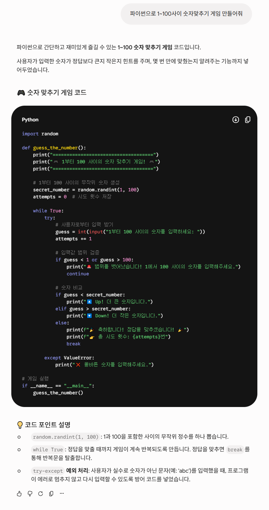
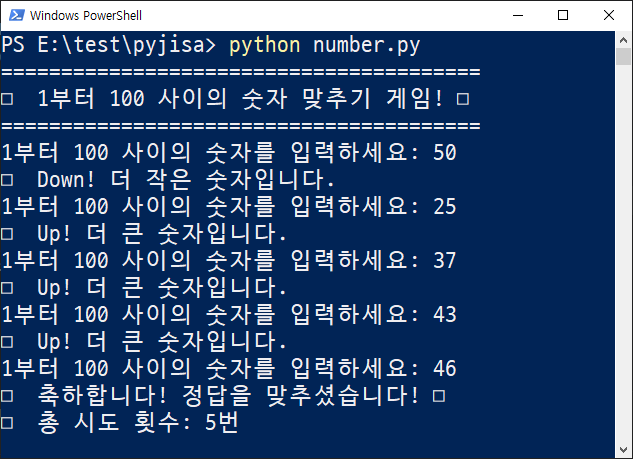

# 숫자맞추기 게임

## Gemini에게 물어보기




---

## gemini가 알려준 파이썬 코드

```python
import random

def guess_the_number():
    print("====================================")
    print("🎮 1부터 100 사이의 숫자 맞추기 게임! 🎮")
    print("====================================")
    
    # 1부터 100 사이의 무작위 숫자 생성
    secret_number = random.randint(1, 100)
    attempts = 0  # 시도 횟수 저장
    
    while True:
        try:
            # 사용자로부터 입력 받기
            guess = int(input("1부터 100 사이의 숫자를 입력하세요: "))
            attempts += 1
            
            # 입력값 범위 검증
            if guess < 1 or guess > 100:
                print("🚨 범위를 벗어났습니다! 1에서 100 사이의 숫자를 입력해주세요.")
                continue
                
            # 숫자 비교
            if guess < secret_number:
                print("🔼 Up! 더 큰 숫자입니다.")
            elif guess > secret_number:
                print("🔽 Down! 더 작은 숫자입니다.")
            else:
                print(f"🎉 축하합니다! 정답을 맞추셨습니다! 🎉")
                print(f"👉 총 시도 횟수: {attempts}번")
                break
                
        except ValueError:
            print("❌ 올바른 숫자를 입력해주세요.")

# 게임 실행
if __name__ == "__main__":
    guess_the_number()
```    

---

## 실행 화면

