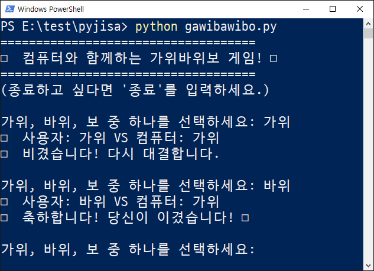

# 가위바위보 게임

## Gemini에게 물어보기

---

**질문: 가위바위보 게임 파이썬 코드**

<br>

**gemini 답:**

파이썬으로 간단하게 즐길 수 있는 **가위바위보 게임** 코드입니다.

컴퓨터가 무작위로 가위, 바위, 보 중 하나를 선택하고, 사용자의 입력과 비교하여 승·무·패를 판정합니다. 잘못된 입력에 대한 예외 처리와 게임 종료 기능도 포함되어 있습니다.

---

### ✊✌️✋ 가위바위보 게임 코드

```python
import random

def rps_game():
    # 선택지 리스트
    choices = ["가위", "바위", "보"]
    
    print("====================================")
    print("🤖 컴퓨터와 함께하는 가위바위보 게임! 🤖")
    print("====================================")
    print("(종료하고 싶다면 '종료'를 입력하세요.)\n")

    while True:
        # 컴퓨터의 무작위 선택
        computer_choice = random.choice(choices)
        
        # 사용자 입력 받기
        user_choice = input("가위, 바위, 보 중 하나를 선택하세요: ").strip()
        
        # 종료 조건 확인
        if user_choice == "종료":
            print("\n👋 게임을 종료합니다. 다음에 또 봐요!")
            break
            
        # 올바른 입력인지 검증
        if user_choice not in choices:
            print("🚨 잘못된 입력입니다! '가위', '바위', '보' 중에서만 입력해주세요.\n")
            continue
            
        print(f"👉 사용자: {user_choice} VS 컴퓨터: {computer_choice}")
        
        # 승패 판정 무직
        if user_choice == computer_choice:
            print("🤝 비겼습니다! 다시 대결합니다.\n")
        elif (user_choice == "가위" and computer_choice == "보") or \
             (user_choice == "바위" and computer_choice == "가위") or \
             (user_choice == "보" and computer_choice == "바위"):
            print("🎉 축하합니다! 당신이 이겼습니다! 🎉\n")
        else:
            print("💻 컴퓨터가 이겼습니다! 아쉽네요. 😢\n")

# 게임 실행
if __name__ == "__main__":
    rps_game()

```

---

### 💡 코드 포인트 설명

* **`random.choice(choices)`**: 리스트 `["가위", "바위", "보"]` 안에서 무작위로 아이템을 하나 추출합니다.
* **`strip()`**: 사용자가 입력할 때 실수로 넣은 앞뒤 공백(예: `" 가위 "`)을 제거해 주어 입력 오류를 줄입니다.
* **판정 조건 논리**: 승리 조건을 한눈에 볼 수 있도록 백슬래시(`\`)를 사용해 줄을 나누어 가독성을 높였습니다. 사용자가 이기는 3가지 경우를 제외하고, 비기는 경우를 먼저 걸러냈기 때문에 남은 모든 경우는 컴퓨터의 승리가 됩니다.

---

## 실행화면

