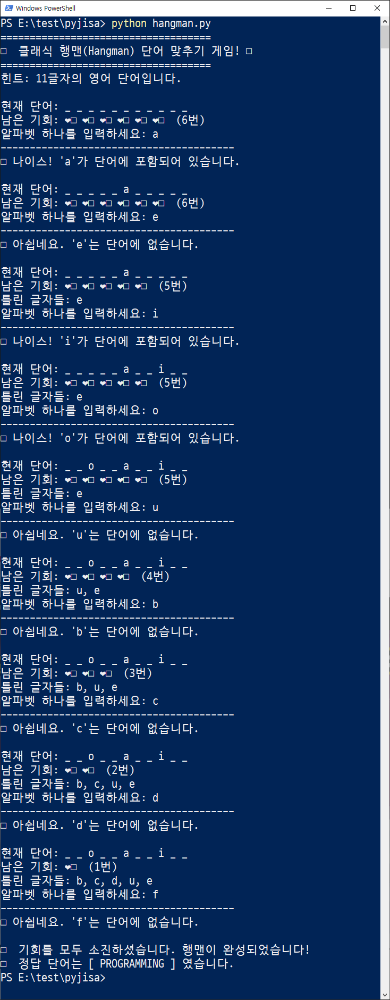
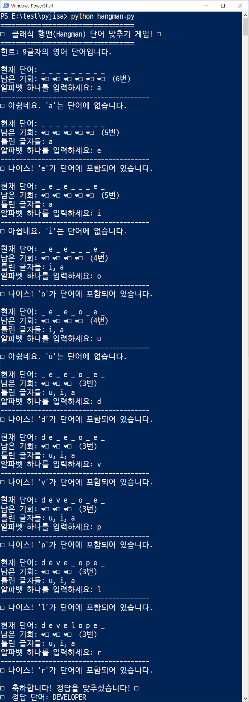

# 행맨 게임

## Gemini에게 물어보기

---

**질문: 단어 맞추는 행맨 게임 파이썬 코드**

<br>

**gemini 답:**

파이썬으로 구현한 클래식한 **행맨(Hangman) 단어 맞추기 게임** 코드입니다.

기회(목숨)는 총 6번 주어지며, 사용자가 알파벳을 하나씩 입력하면서 숨겨진 단어를 추리하는 방식으로 작동합니다.

---

### 🔤 행맨 게임 코드

```python
import random

def hangman_game():
    # 게임에 사용할 단어 풀 (원하는 단어를 마음껏 추가해보세요!)
    words = ["python", "programming", "developer", "computer", "jupiter", "science", "strawberry"]
    
    # 무작위로 하나의 단어 선택
    secret_word = random.choice(words)
    
    # 맞춘 글자를 기록할 세트 (중복 방지)
    guessed_letters = set()
    
    # 남은 기회 (행맨 몸통 개수에 맞춤)
    turns = 6

    print("====================================")
    print("🎩 클래식 행맨(Hangman) 단어 맞추기 게임! 🎩")
    print("====================================")
    print(f"힌트: {len(secret_word)}글자의 영어 단어입니다.\n")

    while turns > 0:
        # 현재까지 맞춘 상황을 화면에 표시 (예: p _ t h _ _ )
        display_word = ""
        for letter in secret_word:
            if letter in guessed_letters:
                display_word += letter + " "
            else:
                display_word += "_ "
        
        print(f"현재 단어: {display_word.strip()}")
        print(f"남은 기회: {'❤️ ' * turns} ({turns}번)")
        
        # 이미 입력했던 틀린 글자들을 보여줌
        wrong_letters = [l for l in guessed_letters if l not in secret_word]
        if wrong_letters:
            print(f"틀린 글자들: {', '.join(wrong_letters)}")
        
        # 1글자 입력 받기
        guess = input("알파벳 하나를 입력하세요: ").lower().strip()
        print("-" * 40)

        # 입력값 검증 (알파벳 1개인지 확인)
        if len(guess) != 1 or not guess.isalpha():
            print("🚨 올바른 알파벳 1글자만 입력해주세요.\n")
            continue

        # 이미 입력했던 글자인지 확인
        if guess in guessed_letters:
            print(f"⚠️ 이미 입력했던 글자('{guess}')입니다. 다른 글자를 입력하세요.\n")
            continue

        # 맞춘 글자 목록에 추가
        guessed_letters.add(guess)

        # 정답 단어에 입력한 글자가 있는지 확인
        if guess in secret_word:
            print(f"✨ 나이스! '{guess}'가 단어에 포함되어 있습니다.\n")
            
            # 모든 글자를 다 맞췄는지 확인
            # secret_word의 모든 글자가 guessed_letters에 들어갔다면 승리!
            if all(letter in guessed_letters for letter in secret_word):
                print(f"🎉 축하합니다! 정답을 맞추셨습니다! 🎉")
                print(f"👉 정답 단어: {secret_word.upper()}")
                break
        else:
            print(f"❌ 아쉽네요. '{guess}'는 단어에 없습니다.\n")
            turns -= 1

    else:
        # while 문이 break 없이 정상적으로 종료된 경우 (turns == 0)
        print("💀 기회를 모두 소진하셨습니다. 행맨이 완성되었습니다!")
        print(f"👉 정답 단어는 [ {secret_word.upper()} ] 였습니다.")

# 게임 실행
if __name__ == "__main__":
    hangman_game()

```

---

### 💡 코드 포인트 설명

* **`random.choice(words)`**: 준비된 단어 리스트 중에서 컴퓨터가 문제를 낼 단어 하나를 무작위로 고릅니다.
* **`guessed_letters = set()`**: 사용자가 입력한 글자들을 저장하는 집합(Set)입니다. 중복 입력을 방지하고 글자가 포함되어 있는지 빠르게 체크하기 좋습니다.
* **`all(letter in guessed_letters for letter in secret_word)`**: 파이썬의 내장 함수 `all()`을 사용해 정답 단어의 **모든 알파벳**이 사용자가 맞춘 글자 목록에 들어왔는지 한 번에 검사합니다. 모두 들어왔다면 게임에서 승리합니다.
* **`while - else` 문**: 파이썬 특유의 문법으로, `while` 루프가 중간에 `break`로 끊기지 않고 **조건이 거짓(기회가 0)이 되어 끝났을 때만** `else` 블록이 실행됩니다. 즉, 정답을 못 맞추고 기회를 다 날렸을 때의 패배 문구를 띄우기에 안성맞춤입니다.

---

## 실행화면



