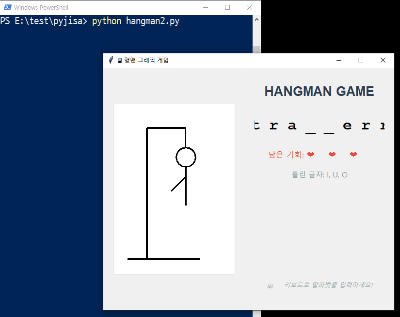

# 행맨 게임 그래픽 버전

## Gemini에게 물어보기

---

**질문: 방금 전 행맨 게임을 그래픽 버전으로 만들어줘**

<br>

**gemini 답:**

텍스트 기반이었던 행맨 게임을 파이썬의 표준 GUI 라이브러리인 `tkinter`를 활용해 시각적인 그래픽 버전으로 업그레이드했습니다!

기회가 차감될 때마다 **행맨이 교수대에 매달리는 모습이 실시간으로 그려지며**, 마우스 클릭 대신 키보드로 타이핑하여 게임을 즐길 수 있습니다. 별도의 외부 라이브러리 설치 없이 바로 실행 가능합니다.

---

### 🎨 행맨 게임 그래픽 버전 코드

```python
import tkinter as tk
from tkinter import messagebox
import random

class HangmanGUI:
    def __init__(self, root):
        self.root = root
        self.root.title("🎴 행맨 그래픽 게임")
        self.root.geometry("600x500")
        self.root.resizable(False, False)
        
        # 게임 단어 풀
        self.words = ["python", "programming", "developer", "computer", "jupiter", "science", "strawberry"]
        
        # 키보드 입력 바인딩
        self.root.bind("<Key>", self.handle_keypress)
        
        self.reset_game()

    def reset_game(self):
        """게임 데이터를 초기화하고 화면을 그립니다."""
        self.secret_word = random.choice(self.words)
        self.guessed_letters = set()
        self.turns = 6
        
        # 기존 위젯이 있다면 제거
        for widget in self.root.winfo_children():
            widget.destroy()
            
        # 상단 레이아웃 분할
        self.create_widgets()
        self.draw_hangman()

    def create_widgets(self):
        """GUI 위젯들을 배치합니다."""
        # 1. 행맨이 그려질 캔버스 (좌측)
        self.canvas = tk.Canvas(self.root, width=250, height=350, bg="white", highlightthickness=1, highlightbackground="#ccc")
        self.canvas.pack(side=tk.LEFT, padx=20, pady=20)
        
        # 2. 정보 우측 프레임
        self.right_frame = tk.Frame(self.root)
        self.right_frame.pack(side=tk.RIGHT, fill=tk.BOTH, expand=True, padx=20, pady=20)
        
        # 타이틀
        title_label = tk.Label(self.right_frame, text="HANGMAN GAME", font=("Helvetica", 20, "bold"), fg="#2c3e50")
        title_label.pack(pady=10)
        
        # 숨겨진 단어 표시판 ( _ _ _ _ )
        self.word_label = tk.Label(self.right_frame, text=self.get_display_word(), font=("Courier", 24, "bold"))
        self.word_label.pack(pady=20)
        
        # 남은 기회 표시
        self.turns_label = tk.Label(self.right_frame, text=f"남은 기회: {'❤️ ' * self.turns}", font=("맑은 고딕", 12), fg="#e74c3c")
        self.turns_label.pack(pady=5)
        
        # 오답 글자 표시
        self.wrong_label = tk.Label(self.right_frame, text="틀린 글자: ", font=("맑은 고딕", 11), fg="#7f8c8d", wraplength=250)
        self.wrong_label.pack(pady=10)
        
        # 안내 문구
        info_label = tk.Label(self.right_frame, text="⌨️ 키보드로 알파벳을 입력하세요!", font=("맑은 고딕", 10, "italic"), fg="#95a5a6")
        info_label.pack(side=tk.BOTTOM, pady=20)

    def get_display_word(self):
        """현재까지 맞춘 단어 상태를 문자열로 반환합니다."""
        return " ".join([letter if letter in self.guessed_letters else "_" for letter in self.secret_word])

    def draw_hangman(self):
        """남은 기회에 따라 캔버스에 행맨을 그립니다."""
        self.canvas.delete("all")
        
        # 기본 교수대 (언제나 그려짐)
        self.canvas.create_line(30, 320, 180, 320, width=4)  # 바닥
        self.canvas.create_line(70, 320, 70, 50, width=4)    # 기둥
        self.canvas.create_line(70, 50, 150, 50, width=4)    # 위 대들보
        self.canvas.create_line(150, 50, 150, 90, width=2)   # 밧줄
        
        # 기회 깎임에 따라 신체 부위 추가
        if self.turns <= 5: # 머리
            self.canvas.create_oval(130, 90, 170, 130, width=3)
        if self.turns <= 4: # 몸통
            self.canvas.create_line(150, 130, 150, 210, width=3)
        if self.turns <= 3: # 왼팔
            self.canvas.create_line(150, 150, 120, 180, width=3)
        if self.turns <= 2: # 오른팔
            self.canvas.create_line(150, 150, 180, 180, width=3)
        if self.turns <= 1: # 왼다리
            self.canvas.create_line(150, 210, 120, 260, width=3)
        if self.turns <= 0: # 오른다리 (게임 오버)
            self.canvas.create_line(150, 210, 180, 260, width=3)

    def handle_keypress(self, event):
        """키보드 입력을 처리하는 핵심 로직입니다."""
        guess = event.char.lower()
        
        # 알파벳 글자 하나가 맞는지 확인
        if len(guess) != 1 or not guess.isalpha():
            return
            
        # 이미 입력한 글자 패스
        if guess in self.guessed_letters:
            return
            
        self.guessed_letters.add(guess)
        
        if guess in self.secret_word:
            # 정답 레이블 갱신
            self.word_label.config(text=self.get_display_word())
            
            # 승리 조건 확인
            if all(l in self.guessed_letters for l in self.secret_word):
                self.end_game(True)
        else:
            self.turns -= 1
            self.turns_label.config(text=f"남은 기회: {'❤️ ' * self.turns}")
            
            # 틀린 글자 목록 갱신
            wrong_letters = [l for l in self.guessed_letters if l not in self.secret_word]
            self.wrong_label.config(text=f"틀린 글자: {', '.join(wrong_letters).upper()}")
            
            # 행맨 다시 그리기
            self.draw_hangman()
            
            # 패배 조건 확인
            if self.turns <= 0:
                self.end_game(False)

    def end_game(self, won):
        """게임 종료 메시지를 띄우고 재시작 여부를 묻습니다."""
        if won:
            msg = f"🎉 승리했습니다! 🎉\n\n정답 단어: {self.secret_word.upper()}"
        else:
            msg = f"💀 패배했습니다... 행맨이 완성되었습니다.\n\n정답 단어: {self.secret_word.upper()}"
            
        if messagebox.askyesno("게임 종료", msg + "\n\n다시 플레이하시겠습니까?"):
            self.reset_game()
        else:
            self.root.quit()

# 프로그램 실행
if __name__ == "__main__":
    root = tk.Tk()
    game = HangmanGUI(root)
    root.mainloop()

```

---

### 💡 그래픽 버전의 특징 및 변경점

* **`tk.Canvas` 활용**: 텍스트 대신 `create_line`(선)과 `create_oval`(원) 메소드를 사용해 캔버스 위에 실시간으로 졸라맨 형태의 행맨을 직접 그려줍니다.
* **이벤트 바인딩 (`root.bind`)**: 따로 텍스트 창에 입력하고 엔터를 누를 필요 없이, 프로그램 창이 켜진 상태에서 **키보드로 알파벳을 타이핑하면 즉시 인식**해 게임이 진행됩니다.
* **`messagebox` 안내창**: 게임에서 이기거나 졌을 때 직관적인 팝업창을 띄워주고, 예(`Yes`)/아니오(`No`) 버튼을 통해 게임을 무한 재시작할 수 있게 설계했습니다.

---

## 실행화면



정답은 strawberry인데 정답의 양옆이 잘려서 제대로 보이지 않고 있다.