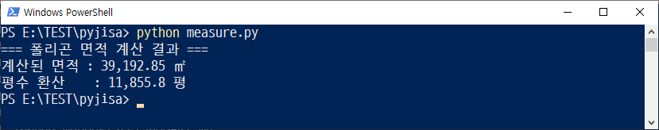

# 폴리곤 넓이

## Gemini에게 물어보기

---

**질문: Shapely 라이브러리를 이용해 EPSG:4326 좌표 여러 개로 구성된 폴리곤의 넓이를 구하는 파이썬 코드**

<br>

**gemini 답:**

**EPSG:4326(WGS84 위경도)** 좌표계는 지구가 둥글다는 것을 가정하고 만든 '구면 좌표계'입니다. 단위가 미터($m$)가 아니라 도(Degree)이기 때문에, 이 상태에서 `shapely` 폴리곤의 면적(`.area`)을 계산하면 제곱미터($m^2$)가 아닌 제곱도(Square Degree)라는 쓸모없는 값이 나옵니다.

따라서 정확한 면적(제곱미터)을 구하려면, 위경도 좌표로 폴리곤을 만든 뒤 이를 **미터 단위의 투영 좌표계(예: 한국이라면 EPSG:5179, 전 세계 범용이라면 UTM 좌표계)로 변환한 후** 면적을 계산해야 합니다.

가장 표준적이고 세련된 방식인 `shapely`와 좌표 변환을 돕는 `pyproj`를 결합한 코드를 소개해 드립니다.

### 💻 EPSG:4326 폴리곤 면적 계산 코드

실행 전 라이브러리를 설치해 주세요. (`pip install shapely pyproj`)

```python
from shapely.geometry import Polygon
from pyproj import Transformer
from shapely.ops import transform

def calculate_wgs84_polygon_area(lon_lat_list):
    """
    WGS84(EPSG:4326) 경위도 좌표 리스트를 받아 
    제곱미터(㎡) 및 평수 단위로 정확한 면적을 계산합니다.
    """
    # 1. 입력받은 경위도 좌표로 Shapely 폴리곤 생성
    # (주의: Shapely는 기본적으로 (X, Y) 순서이므로 (경도, 위도) 순으로 넣어야 합니다)
    polygon_4326 = Polygon(lon_lat_list)
    
    # 2. 좌표 변환 정의 (EPSG:4326 -> 한국 표준 미터 좌표계인 EPSG:5179 UTM-K 사용)
    # ※ 만약 해외 지역이라면 해당 지역의 UTM Zone 번호나 EPSG:3857 등을 사용할 수 있습니다.
    project = Transformer.from_crs("EPSG:4326", "EPSG:5179", always_xy=True).transform
    
    # 3. 폴리곤의 모든 꼭짓점 좌표를 미터(m) 단위 좌표계로 일괄 변환
    polygon_meter = transform(project, polygon_4326)
    
    # 4. 변환된 폴리곤의 면적 구하기 (.area 메서드 활용)
    area_sq_meters = polygon_meter.area
    
    # 5. 평수로 환산 (1제곱미터 = 0.3025평)
    area_pyeong = area_sq_meters * 0.3025
    
    return area_sq_meters, pyeong

# --- 실행 및 테스트 ---
if __name__ == "__main__":
    # 예시 좌표: 서울시청 인근을 아우르는 가상의 사각형 필지 (경도, 위도 순서)
    # ※ 주의: 폴리곤을 닫기 위해 첫 번째 좌표와 마지막 좌표는 같아야 합니다.
    test_coordinates = [
        (126.9770, 37.5670),  # 좌측 상단
        (126.9790, 37.5670),  # 우측 상단
        (126.9790, 37.5650),  # 우측 하단
        (126.9770, 37.5650),  # 좌측 하단
        (126.9770, 37.5670)   # 다시 첫 점으로 돌아와서 닫기
    ]
    
    m2, pyeong = calculate_wgs84_polygon_area(test_coordinates)
    
    print(f"=== 폴리곤 면적 계산 결과 ===")
    print(f"계산된 면적 : {m2:,.2f} ㎡")
    print(f"평수 환산    : {pyeong:,.1f} 평")

```

---

### 💡 핵심 포인트 설명

1. **`shapely.ops.transform` 활용:** 폴리곤 객체 내부의 수많은 꼭짓점을 반복문(`for`)으로 하나하나 변환하면 속도가 느리고 코드가 지저분해집니다. `shapely`에서 제공하는 `transform` 함수를 쓰면 폴리곤 형태를 유지한 채 내부 좌표들만 미터 단위로 통째로 압축 변환해 줍니다.
2. **왜 하필 `EPSG:5179` 인가요?**
웹 지도에서 흔히 쓰는 `EPSG:3857`(구글 메르카토르)은 적도 부근은 정확하지만 고위도로 갈수록 면적이 심하게 왜곡됩니다. 한국 지형의 면적이나 지적을 정밀하게 측정할 때는 국토지리정보원 표준인 `EPSG:5179` (UTM-K)나 **`EPSG:5186`** 같은 투영 좌표계로 변환해야 오차 없는 정밀한 면적($m^2$)을 얻을 수 있습니다.

---

## 실행 하기

### 관련 라이브러리 설치

```powershell
pip install shapely pyproj
```

### 실행하기

```powershell
python measure.py
```



\* AI가 만들어준 코드에 오류가 있어 수정하였습니다.

이 코드 안에는 서울 시청 부근의 WGS84 좌표가 포함되어 있어 그 좌표들을 이용해 면적을 계산하고 있다. 이 부분의 코드를 수정하면 원하는 지역의 넓이를 계산할 수 있다.

놀라운 건, AI가 그냥 WGS84 위경도 좌표 만으로는 제곱 미터 단위의 넓이를 계산할 수 없으니 이걸 UTM-K 로 변환해 면적을 계산해 주겠다고 하면서 알아서 코드를 만들어 주었다는 점이다.