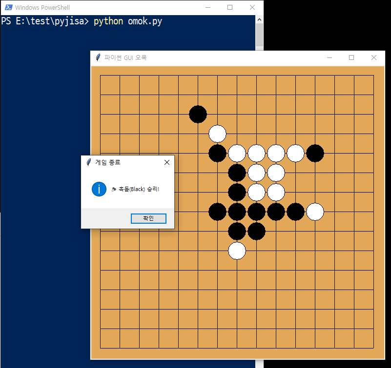

# 오목 게임 그래픽 버전

## Gemini에게 물어보기

---

**질문: 그래픽 UI를 가진 오목게임 파이썬 코드**

<br>

**gemini 답:**

파이썬에서 그래픽 UI(GUI)를 구현할 때 별도의 설치 없이 가장 기본적으로 쓸 수 있는 **`tkinter`** 라이브러리를 활용한 **오목 게임** 코드입니다.

초보자도 코드를 보고 이해할 수 있도록 복잡한 인공지능(AI)은 빼고, **친구와 번갈아 가며 둘 수 있는 2인용 오목**으로 깔끔하게 구현했습니다.

---

### 🎮 파이썬 GUI 오목 게임 코드

```python
import tkinter as tk
from tkinter import messagebox

class OmokGame:
    def __init__(self, root):
        self.root = root
        self.root.title("파이썬 GUI 오목")
        
        # 게임 설정 (15x15 바둑판)
        self.board_size = 15
        self.cell_size = 40  # 격자 크기 (픽셀)
        self.current_player = 1  # 1: 흑돌, 2: 백돌
        
        # 바둑판 상태 저장 (0: 빈칸, 1: 흑, 2: 백)
        self.board = [[0] * self.board_size for _ in range(self.board_size)]
        
        # 캔버스 생성 (바둑판 그리기용)
        self.canvas_size = self.board_size * self.cell_size
        self.canvas = tk.Canvas(root, width=self.canvas_size, height=self.canvas_size, bg="#E3A857")
        self.canvas.pack()
        
        # 바둑판 선 그리기 및 클릭 이벤트 연결
        self.draw_board()
        self.canvas.bind("<Button-1>", self.click_event)

    def draw_board(self):
        """바둑판의 격자선을 그리는 함수"""
        for i in range(self.board_size):
            # 가로선
            self.canvas.create_line(
                self.cell_size // 2, self.cell_size // 2 + i * self.cell_size,
                self.canvas_size - self.cell_size // 2, self.cell_size // 2 + i * self.cell_size
            )
            # 세로선
            self.canvas.create_line(
                self.cell_size // 2 + i * self.cell_size, self.cell_size // 2,
                self.cell_size // 2 + i * self.cell_size, self.canvas_size - self.cell_size // 2
            )

    def click_event(self, event):
        """바둑판 클릭 시 돌을 놓는 함수"""
        # 클릭한 좌표를 바둑판의 행(row), 열(col) 인덱스로 변환
        col = round((event.x - self.cell_size // 2) / self.cell_size)
        row = round((event.y - self.cell_size // 2) / self.cell_size)
        
        # 바둑판 범위를 벗어나거나 이미 돌이 있는 곳이면 무시
        if not (0 <= row < self.board_size and 0 <= col < self.board_size):
            return
        if self.board[row][col] != 0:
            return
            
        # 바둑판 배열 업데이트 및 돌 그리기
        self.board[row][col] = self.current_player
        self.draw_stone(row, col)
        
        # 승리 판정
        if self.check_win(row, col):
            winner = "흑돌(Black)" if self.current_player == 1 else "백돌(White)"
            messagebox.showinfo("게임 종료", f"🎉 {winner} 승리!")
            self.reset_game()
            return
            
        # 턴 교체 (1 -> 2, 2 -> 1)
        self.current_player = 2 if self.current_player == 1 else 1

    def draw_stone(self, row, col):
        """화면에 바둑돌을 그리는 함수"""
        x = self.cell_size // 2 + col * self.cell_size
        y = self.cell_size // 2 + row * self.cell_size
        r = self.cell_size // 2 - 2  # 돌의 반지름
        
        color = "black" if self.current_player == 1 else "white"
        self.canvas.create_oval(x - r, y - r, x + r, y + r, fill=color, outline="black")

    def check_win(self, row, col):
        """돌이 놓인 자리 기준으로 5개가 연속되었는지 확인하는 함수"""
        # 체크할 4가지 방향 (가로, 세로, 우하향 대각선, 우상향 대각선)
        directions = [(0, 1), (1, 0), (1, 1), (-1, 1)]
        player = self.board[row][col]
        
        for dr, dc in directions:
            count = 1  # 방금 놓은 돌 포함
            
            # 한쪽 방향으로 전진하며 체크
            r, c = row + dr, col + dc
            while 0 <= r < self.board_size and 0 <= c < self.board_size and self.board[r][c] == player:
                count += 1
                r += dr
                c += dc
                
            # 반대 방향으로 전진하며 체크
            r, c = row - dr, col - dc
            while 0 <= r < self.board_size and 0 <= c < self.board_size and self.board[r][c] == player:
                count += 1
                r -= dr
                c -= dc
                
            # 정확히 5개이거나 그 이상(장목)이면 승리 (간단한 규칙 적용)
            if count >= 5:
                return True
        return False

    def reset_game(self):
        """게임을 초기화하는 함수"""
        self.board = [[0] * self.board_size for _ in range(self.board_size)]
        self.canvas.delete("all")
        self.draw_board()
        self.current_player = 1

# 프로그램 실행
if __name__ == "__main__":
    root = tk.Tk()
    game = OmokGame(root)
    root.mainloop()

```

---

### 💡 코드의 주요 포인트 설명 (초보자용)

1. **`tkinter.Canvas`**: 화면에 선을 긋거나 동그라미를 그릴 수 있는 도화지 역할을 합니다. 바둑판 배경색은 센스 있게 나무색(`#E3A857`)으로 지정했습니다.
2. **`canvas.bind("<Button-1>", ...)`**: 사용자가 마우스 왼쪽 버튼을 클릭했을 때 특정 함수(`click_event`)가 실행되도록 연결해 주는 윈도우 프로그래밍의 핵심 기능입니다.
3. **`round()` 함수**: 사용자가 정확히 선 교차점을 누르지 않고 근처만 눌러도, 가장 가까운 교차점에 이쁘게 돌이 올라가도록 수학적으로 반올림 처리를 해주었습니다.
4. **승리 알고리즘 (`check_win`)**: 바둑돌이 놓인 순간, 그 돌을 기준으로 **가로, 세로, 대각선 2방향** 양쪽으로 쭉 뻗어나가며 같은 색 돌이 총 5개 이상 연속되었는지 검사합니다.

### 🏃 실행 방법

파이썬이 설치된 환경(VS Code, PyCharm, IDLE 등)에서 위 코드를 복사해 `.py` 파일로 저장한 뒤 실행하면 이쁜 바둑판 창이 팝업됩니다. 흑돌부터 시작해 번갈아 두면서 오목을 즐겨보세요!

---

## 실행화면

