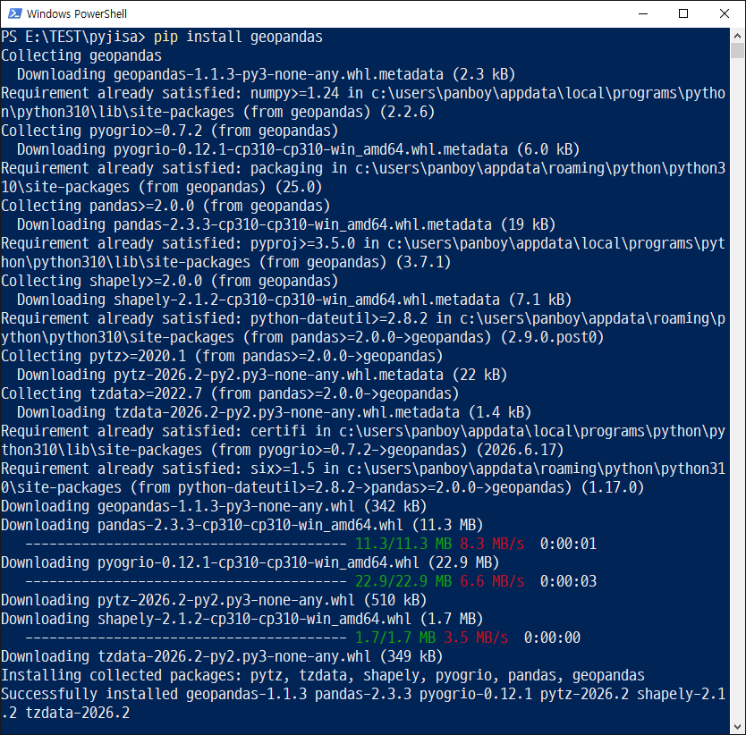
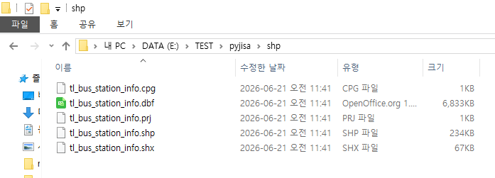
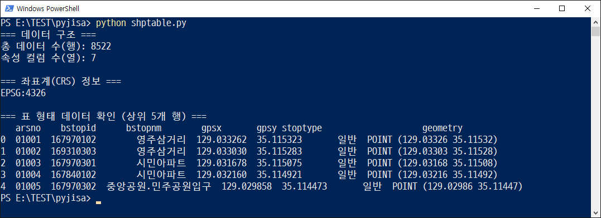

# shp 파일 자료 뷰어

## shp 파일 다운로드


- 자료: 부산광역시 버스 정류소 정보(SHP)
- url: [https://www.data.go.kr/data/15084251/fileData.do](https://www.data.go.kr/data/15084251/fileData.do)


## Gemini에게 물어보기

---

**질문: shape 파일을 geopandas를 이용해 표 형태로 보여주는 파이썬 코드**

<br>

**gemini 답:**

파이썬의 **`geopandas`** 라이브러리를 사용하면 GIS 공간 데이터인 Shapefile(`.shp`)을 마치 엑셀이나 판다스(Pandas)의 데이터프레임처럼 표 형태로 아주 쉽게 읽어와 확인할 수 있습니다.

코드를 실행하기 전에 관련 라이브러리가 설치되어 있지 않다면 먼저 설치해 주세요. (`geopandas`를 설치하면 표 형태 처리를 위한 `pandas`와 내부 연산 라이브러리들이 함께 설치됩니다.)

```bash
pip install geopandas

```

### 💻 Shapefile을 표 형태로 보여주는 파이썬 코드

```python
import geopandas as gpd

def display_shapefile(file_path):
    try:
        # 1. Shapefile 읽기 (.shp 파일 경로 입력)
        # 팁: .shp 파일과 같은 폴더에 .dbf, .shx, .prj 파일이 함께 있어야 온전하게 읽힙니다.
        gdf = gpd.read_file(file_path)
        
        # 2. 데이터 구조 확인 (총 행과 열의 수)
        print(f"=== 데이터 구조 ===")
        print(f"총 데이터 수(행): {gdf.shape[0]}")
        print(f"속성 컬럼 수(열): {gdf.shape[1]}\n")
        
        # 3. 좌표계(CRS) 정보 확인 (지적측량이나 지도 매핑 시 필수 확인)
        print(f"=== 좌표계(CRS) 정보 ===")
        print(f"{gdf.crs}\n")
        
        # 4. 상위 5개 행을 표 형태로 출력
        print("=== 표 형태 데이터 확인 (상위 5개 행) ===")
        # 판다스와 마찬가지로 head()를 사용해 표 형태로 출력합니다.
        # 가장 오른쪽 컬럼에 'geometry'라는 이름으로 공간 도형 정보(POINT, POLYGON 등)가 자동으로 들어옵니다.
        print(gdf.head())
        
        # (선택 사항) 만약 텍스트가 잘리지 않고 모든 컬럼을 보고 싶다면 아래 주석을 해제하세요.
        # import pandas as pd
        # pd.set_option('display.max_columns', None)
        # pd.set_option('display.width', 1000)
        # print(gdf.head())

    except Exception as e:
        print(f"파일을 읽는 중 오류가 발생했습니다: {e}")

# --- 실행 부분 ---
# 본인의 컴퓨터에 있는 실제 .shp 파일 경로를 입력해 주세요.
# 예시: "C:/data/seoul_cadastral.shp" 또는 "./지적도_데이터.shp"
file_path = "your_file_path_here.shp" 

display_shapefile(file_path)

```

### 💡 알아두면 좋은 포인트

1. **필수 세트 파일들:** `.shp` 파일만 달랑 있으면 GeoPandas가 표 안의 글자 데이터(토지대장 정보, 속성 등)를 읽지 못합니다. 속성 정보가 담긴 **`.dbf`** 파일과 인덱스 파일인 **`.shx`** 파일이 반드시 같은 이름으로 동일한 폴더에 저장되어 있어야 합니다.
2. **`geometry` 컬럼:** GeoPandas로 데이터를 로드하면 표의 맨 마지막 열에 무조건 `geometry`라는 특수 컬럼이 생깁니다. 이 컬럼 안에 지적측량 필지의 면(Polygon) 좌표들이나 점(Point) 좌표들이 들어가 있어, 나중에 표 상태 그대로 지도에 그리거나 공간 연산을 할 수 있게 해줍니다.

---

## 실행 하기

### 관련 라이브러리 설치

```powershell
pip install geopandas
```

<br />

powerShell에서 위 문구를 실행한다.



<br />

### 파일 복사

1. 다운로드 받은 zip 파일의 압축을 푼다.
2. 현재 파이썬 소스코드가 있는 곳에 shp 폴더를 만든다.
3. shp 폴더 안에 압축 푼 파일을 복사해 넣는다.

<br />



<br />

### 코드 수정

```python
# --- 실행 부분 ---
# 본인의 컴퓨터에 있는 실제 .shp 파일 경로를 입력해 주세요.
# 예시: "C:/data/seoul_cadastral.shp" 또는 "./지적도_데이터.shp"
file_path = "./shp/tl_bus_station_info.shp" 

```

### 실행하기

```powershell
python shptable.py
```
```
PS E:\TEST\pyjisa> python shptable.py
=== 데이터 구조 ===
총 데이터 수(행): 8522
속성 컬럼 수(열): 7

=== 좌표계(CRS) 정보 ===
EPSG:4326

=== 표 형태 데이터 확인 (상위 5개 행) ===
   arsno    bstopid      bstopnm        gpsx       gpsy stoptype                    geometry
0  01001  167970102        영주삼거리  129.033262  35.115323       일반  POINT (129.03326 35.11532)
1  01002  169310303        영주삼거리  129.033030  35.115283       일반  POINT (129.03303 35.11528)
2  01003  167970301        시민아파트  129.031678  35.115075       일반  POINT (129.03168 35.11508)
3  01004  167840102        시민아파트  129.032160  35.114921       일반  POINT (129.03216 35.11492)
4  01005  167970302  중앙공원.민주공원입구  129.029858  35.114473       일반  POINT (129.02986 35.11447)
```

